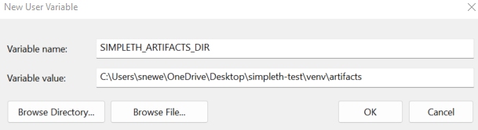

Installing
==========

1) Install Ganache
******************
Ganache is the Ethereum blockchain simulator that runs on your
local system. It must be running whenever you use ``simpleth``.

To install:

- Go to https://trufflesuite.com/ganache/ and click on
  the ``Download (Windows)`` button.
- Follow the **Ganache Quickstart**
  (https://trufflesuite.com/docs/ganache/quickstart/).

.. image:: ../images/section_separator.png

2) Install simpleth package
***************************

.. code-block:: shell-session

   $ pip install simpleth

.. note::

   *attributedict* and *HexBytes* will be installed as pre-reqs.
   *web3.py* uses these for the transaction receipt data structure.

.. image:: ../images/section_separator.png

.. verify_directories_label:

3) Verify directories
*********************
Besides installing ``simpleth``, ` pip` creates three directories for
your use:

#. **artifacts** - smart contract-related files that are needed
   when deploying or using the contracts.
#. **examples** - Python programs used for the `Hello Worlds` and
   one program that you will see in the *Using* document.
#. **contracts** - Solidity source code for `Hello Worlds` and
   `Test` contracts.

`pip` places these directories in your Python ``sys.prefix`` directory.

Let's check for the presence of the directories. (Note, your path will
be different than the one shown.)

.. code-block:: shell-session
   :caption: Use Python interpreter to get sys.prefix

    $ python

    >>> import sys
    >>> sys.prefix
    'C:\\Users\\snewe\\OneDrive\\Desktop\\simpleth-test\\venv'
    >>> exit()

.. code-block:: shell-session
   :caption: Use DOS Window to check for examples and artifacts

    $ cd C:\\Users\\snewe\\OneDrive\\Desktop\\simpleth-test\\venv

    $ C:\Users\snewe\OneDrive\Desktop\simpleth-test\venv>dir
    ... snip ...
    06/07/2022  05:26 PM    <DIR>          artifacts
    06/07/2022  05:26 PM    <DIR>          contracts
    06/07/2022  05:26 PM    <DIR>          examples
    ... snip ...

.. image:: ../images/section_separator.png

.. set_artifacts_label:

3) Set artifacts environment variable
*************************************
The environment variable, ``SIMPLETH_ARTIFACTS_DIR``, needs to have
the path to your ``artifacts`` directory.

You can set it in a DOS window. This takes effect immediately but only work in that
window and lasts for the life of that window.

.. code-block:: shell-session
   :caption: Set artifacts variable in DOS window

    $ set SIMPLETH_ARTIFACTS_DIR=C:\Users\snewe\OneDrive\Desktop\simpleth-test\venv\artifacts

Or, you can make it a permanent setting by editing the `User environment variables`
to add it and then start a new DOS window to pick up the change.

   Screenshot of adding artifacts as a user environment variable

After either way of setting it you can confirm it works:

.. code-block:: shell-session
   :caption: Confirm the environment variable value

    $ cd %SIMPLETH_ARTIFACTS_DIR%
    $ cd
    C:\Users\snewe\OneDrive\Desktop\simpleth-test\venv\artifacts

.. image:: ../images/section_separator.png

4) Download Solidity compiler
*****************************
You can run the `Hello World` contracts and do all the examples in the
`Using` document without installing the Solidity compiler.
If that is the extent of your planned use of ``simpleth``, you can
skip this step.

Otherwise, you will need to have a copy of the Solidity compiler
to compile your contracts before using ``simpleth`` to deploy and
use them.
Download ``solc-windows.exe`` from
`Github page for ethereum//solidity <https://github.com/ethereum/solidity/releases>`_.

It is safest to use the version found in
:ref:`tested levels <sw_levels_label>` .

If you prefer to use a different version, download
it and save it as ``solc.exe`` in the `solc` directory.

.. image:: ../images/section_separator.png

5) Confirm installation
***********************
Make sure `Ganache` is running and try these commands.
If your install is complete, they should run as shown and
without error messages.

.. code-block:: shell-session
   :caption: Confirming simpleth installation

    $ cd %SIMPLETH_ARTIFACTS_DIR%
    $ dir
    ... Artifact files ...

    $ cd ..\contracts
    $ dir
    ... Solidity smart contract programs ...

    $ cd ..\examples
    $ dir
    ... Python example programs ...

    $ python
    >>> from simpleth import Blockchain
    >>> Blockchain().block_number
        ... see sequence number of block at end of chain ...
    >>> exit()

    $ solc --version
    ... see the compiler version number ...

.. note::

    The **Python example programs**:

    - event_poll.py
    - hello_world1.py
    - hello_world2.py
    - hello_world3.py
    - hello_world4.py

    The **Solidity smart contract files**:

    - HelloWorld1.sol
    - HelloWorld2.sol
    - HelloWorld3.sol
    - HelloWorld4.sol
    - Test.sol

    There are two **Artifact files** for each smart contract:

    #. <contract>.abi
    #. <contract>.bin

**Congratulations!** ``simpleth`` is ready for use.